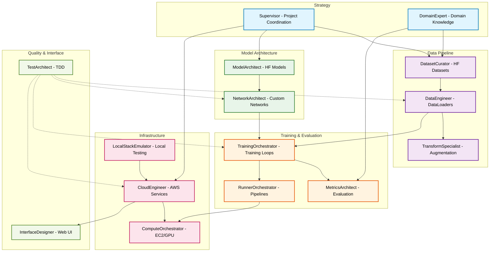

# Agent Team Overview

## Team Visualization

## Agent Roster

<table>
<thead>
<tr>
<th>Agent Name</th>
<th>Description</th>
<th>Tools</th>
<th>Documentation</th>
</tr>
</thead>
<tbody>
<tr>
<td><strong>DatasetCurator</strong></td>
<td>HuggingFace dataset discovery and selection specialist</td>
<td>Read, Write, Edit, Bash</td>
<td><a href="agents/datasets.md">View Details</a></td>
</tr>
<tr>
<td><strong>DataEngineer</strong></td>
<td>PyTorch DataLoader optimization and pipeline specialist</td>
<td>Read, Write, Edit, Bash</td>
<td><a href="agents/dataloader.md">View Details</a></td>
</tr>
<tr>
<td><strong>TransformSpecialist</strong></td>
<td>Data transformation and augmentation pipeline engineer</td>
<td>Read, Write, Edit, Bash</td>
<td><a href="agents/transforms.md">View Details</a></td>
</tr>
<tr>
<td><strong>ModelArchitect</strong></td>
<td>HuggingFace model selection and configuration specialist</td>
<td>Read, Write, Edit, Bash</td>
<td><a href="agents/models.md">View Details</a></td>
</tr>
<tr>
<td><strong>NetworkArchitect</strong></td>
<td>Neural architecture design and customization specialist</td>
<td>Read, Write, Edit, Bash</td>
<td><a href="agents/network.md">View Details</a></td>
</tr>
<tr>
<td><strong>TrainingOrchestrator</strong></td>
<td>Training loop implementation and experiment tracking specialist</td>
<td>Read, Write, Edit, Bash</td>
<td><a href="agents/trainer.md">View Details</a></td>
</tr>
<tr>
<td><strong>MetricsArchitect</strong></td>
<td>Domain-specific metrics and evaluation specialist</td>
<td>Read, Write, Edit, Bash</td>
<td><a href="agents/metrics.md">View Details</a></td>
</tr>
<tr>
<td><strong>CloudEngineer</strong></td>
<td>AWS services and API endpoint implementation specialist</td>
<td>Read, Write, Edit, Bash</td>
<td><a href="agents/cloud.md">View Details</a></td>
</tr>
<tr>
<td><strong>InterfaceDesigner</strong></td>
<td>Web interface and visualization implementation specialist</td>
<td>Read, Write, Edit, Bash</td>
<td><a href="agents/frontend.md">View Details</a></td>
</tr>
<tr>
<td><strong>TestArchitect</strong></td>
<td>Test-driven development specialist for PyTorch ML systems</td>
<td>Read, Write, Edit, Bash</td>
<td><a href="agents/tests.md">View Details</a></td>
</tr>
<tr>
<td><strong>ComputeOrchestrator</strong></td>
<td>EC2 instance management and GPU resource optimization specialist</td>
<td>Read, Write, Edit, Bash</td>
<td><a href="agents/compute.md">View Details</a></td>
</tr>
<tr>
<td><strong>LocalStackEmulator</strong></td>
<td>Local AWS service emulation and testing specialist</td>
<td>Read, Write, Edit, Bash</td>
<td><a href="agents/localstack.md">View Details</a></td>
</tr>
<tr>
<td><strong>RunnerOrchestrator</strong></td>
<td>Training and evaluation pipeline orchestration specialist</td>
<td>Read, Write, Edit, Bash</td>
<td><a href="agents/runner.md">View Details</a></td>
</tr>
<tr>
<td><strong>DomainExpert</strong></td>
<td>Task and domain-specific knowledge specialist</td>
<td>Read, Write, Edit, Bash</td>
<td><a href="agents/expert.md">View Details</a></td>
</tr>
<tr>
<td><strong>Supervisor</strong></td>
<td>Requirements analysis and project constraint coordinator</td>
<td>Read, Write, Edit, Bash</td>
<td><a href="agents/supervisor.md">View Details</a></td>
</tr>
</tbody>
</table>

## Team Organization

### Data Pipeline Team
**Focus**: Data ingestion, preprocessing, and loading optimization

- **DatasetCurator**: Discovers and evaluates datasets from HuggingFace Hub
- **DataEngineer**: Optimizes PyTorch DataLoader pipelines for performance
- **TransformSpecialist**: Implements augmentation and preprocessing strategies

### Model Architecture Team
**Focus**: Model selection, design, and customization

- **ModelArchitect**: Selects and configures pre-trained models from HuggingFace
- **NetworkArchitect**: Designs custom neural network architectures

### Training & Evaluation Team
**Focus**: Training optimization and performance measurement

- **TrainingOrchestrator**: Implements training loops and experiment tracking
- **MetricsArchitect**: Designs domain-specific evaluation metrics
- **RunnerOrchestrator**: Orchestrates end-to-end ML pipelines

### Infrastructure Team
**Focus**: Cloud deployment and compute resource management

- **CloudEngineer**: Deploys models to AWS services and creates APIs
- **ComputeOrchestrator**: Manages EC2 instances and GPU resources
- **LocalStackEmulator**: Provides local AWS service emulation for development

### Quality & Interface Team
**Focus**: Testing and user experience

- **TestArchitect**: Ensures code quality through test-driven development
- **InterfaceDesigner**: Creates web interfaces for ML applications

### Strategy Team
**Focus**: Project planning and domain expertise

- **Supervisor**: Coordinates requirements and project constraints
- **DomainExpert**: Provides specialized knowledge for specific domains

## Module Ownership

| Module | Primary Owner(s) | Collaborators |
|--------|-----------------|---------------|
| `src/data.py` | DatasetCurator, DataEngineer | TransformSpecialist |
| `src/network.py` | NetworkArchitect | ModelArchitect |
| `src/trainer.py` | TrainingOrchestrator | MetricsArchitect |
| `src/server.py` | CloudEngineer | InterfaceDesigner |
| `src/compute.py` | ComputeOrchestrator | - |
| `src/runner.py` | RunnerOrchestrator | - |
| `tests/*.py` | TestArchitect | All agents |
| `apps/` | InterfaceDesigner | CloudEngineer |

## Collaboration Patterns

### Dual-Track Agile Workflows

**Discovery Track** (Continuous):
- Supervisor → Define and refine requirements based on feedback
- DomainExpert → Validate approach and provide domain insights
- Research and planning inform delivery track sprints

**Delivery Track** (Sprint-Based):
- TestArchitect writes tests for sprint backlog items
- Implementation teams work concurrently in tight iteration cycles:
  - DatasetCurator + DataEngineer + TransformSpecialist (data pipeline)
  - ModelArchitect + NetworkArchitect (model architecture)
  - TrainingOrchestrator + MetricsArchitect (training and evaluation)
- Continuous integration and sprint reviews inform discovery track

**Iterative Development Cycle**:
1. Sprint planning: Supervisor prioritizes backlog with team
2. Parallel development: Multiple teams work on sprint items simultaneously
3. Daily integration: TestArchitect validates progress continuously
4. Sprint review: Demonstrate working increments, gather feedback
5. Retrospective: Improve processes and adjust approach

### Parallel Collaboration

**Data Team**: Work simultaneously on data discovery, loading optimization, and transforms

**Infrastructure Team**: Coordinate API development with compute provisioning

**Quality Team**: TestArchitect writes tests in parallel with implementation

## Task Routing Quick Reference

| If you need to... | Primary Agent | Support Agents |
|-------------------|---------------|----------------|
| Find datasets | DatasetCurator | DomainExpert |
| Optimize data loading | DataEngineer | TransformSpecialist |
| Select pre-trained models | ModelArchitect | NetworkArchitect |
| Design custom models | NetworkArchitect | ModelArchitect |
| Implement training | TrainingOrchestrator | MetricsArchitect |
| Deploy to cloud | CloudEngineer | ComputeOrchestrator |
| Test locally with AWS services | LocalStackEmulator | CloudEngineer, ComputeOrchestrator |
| Create web UI | InterfaceDesigner | CloudEngineer |
| Write tests | TestArchitect | LocalStackEmulator |
| Manage EC2 resources | ComputeOrchestrator | CloudEngineer |
| Run experiments | RunnerOrchestrator | TrainingOrchestrator |
| Define project scope | Supervisor | DomainExpert |

## Test-Driven Development Protocol

All agents follow TDD principles:

1. **TestArchitect writes tests FIRST** before any implementation
2. **Implementation agents write code** to pass the tests
3. **All code must have >90% test coverage** before acceptance
4. **Prefer torch.testing** over pytest/unittest for ML components

## Communication Guidelines

- Agents communicate through shared module interfaces
- Each agent maintains expertise documentation in `.claude/agents/`
- Cross-team collaboration requires explicit coordination
- TestArchitect has veto power over untested code

## Getting Started

To engage specific agents:
- Reference them by name: "Consult NetworkArchitect about..."
- Describe the task type: "I need help with data loading" → DataEngineer
- Use the CLAUDE.md routing guide for automatic agent selection