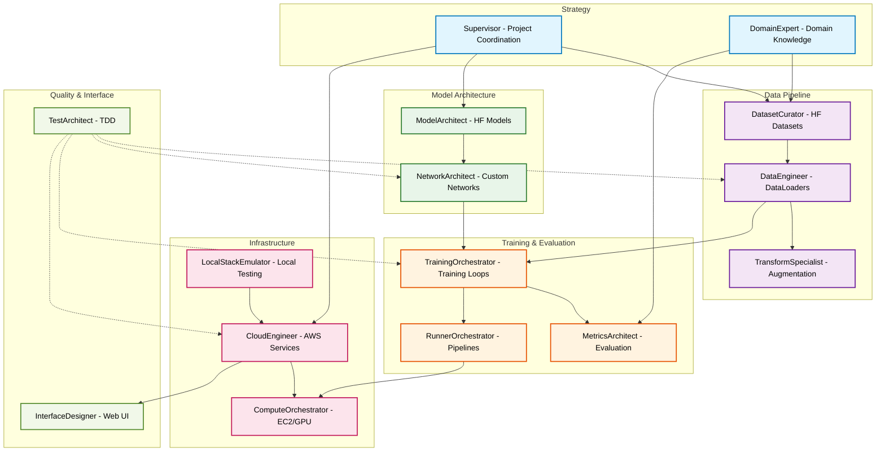

# Claude Code PyTorch

[](https://github.com/jxtngx)
[](https://opensource.org/licenses/Apache-2.0)

A modular, multi-agent based system for PyTorch, Hugging Face, and AWS, powered by Anthropic's Claude family of models.

> **Note**: This project is compatible with GitHub Copilot through `.github/copilot-instructions.md`, which references the same agent architecture defined in `CLAUDE.md`.

## Philosophy

This repository embodies an **agent-based architecture** for machine learning projects, where specialized AI agents collaborate to deliver comprehensive solutions. Each agent maintains deep expertise in their domain while remaining modality and task agnostic.

## Core Principles

<table>
<tr>
<td style="background-color: black; color: #808080; padding: 15px; width: 50%; vertical-align: top;"><h3 style="margin-top: 0; margin-bottom: 10px; color: white;">Separation of Concerns</h3>Each agent owns a specific technical domain, preventing overlap and ensuring expertise depth.</td>
<td style="background-color: black; color: #808080; padding: 15px; width: 50%; vertical-align: top;"><h3 style="margin-top: 0; margin-bottom: 10px; color: white;">Modality Agnostic</h3>Agents adapt to any ML task—vision, NLP, audio, multimodal—without hardcoded assumptions.</td>
</tr>
<tr>
<td style="background-color: black; color: #808080; padding: 15px; width: 50%; vertical-align: top;"><h3 style="margin-top: 0; margin-bottom: 10px; color: white;">Performance First</h3>Optimized for PyTorch 2.3+ with distributed training and NVIDIA GPU acceleration.</td>
<td style="background-color: black; color: #808080; padding: 15px; width: 50%; vertical-align: top;"><h3 style="margin-top: 0; margin-bottom: 10px; color: white;">Cloud Native</h3>Built for AWS EC2 environments with scalable infrastructure patterns.</td>
</tr>
<tr>
<td colspan="2" align="center" style="background-color: black; color: #808080; padding: 15px;"><h3 style="margin-top: 0; margin-bottom: 10px; color: white;">Collaborative Intelligence</h3>Agents work in concert, sharing context and building on each other's outputs.</td>
</tr>
</table>

## Skill Progression Platform

This template serves as a gateway to two critical ML engineering competencies:

### PyTorch Mastery
Progress from basic tensor operations to production-ready ML systems through practical, agent-guided development. The `prompting-guide/` provides a structured path from prompt dependency to independent PyTorch expertise.

### Agentic Application Development
The multi-agent architecture here provides hands-on experience with patterns directly applicable to:
- **LangChain**: Chain-of-thought reasoning, tool use, and agent orchestration
- **AWS Bedrock Agents**: Structured prompts, knowledge bases, and action groups
- **NVIDIA NeMo Guardrails**: Agent safety, structured outputs, and conversation flows

By working with this template's agent team, you're learning:
- Agent coordination patterns (supervisor/worker models)
- Tool use and function calling (ReAct patterns)
- Structured prompting (INVEST+CRPG framework)
- Multi-agent orchestration (parallel and sequential workflows)

These skills transfer directly to building production agent applications, making this template both a PyTorch learning tool and an introduction to the agentic AI ecosystem.

## Structured Requirements Format

This project uses a disciplined approach to requirements specification:

<table>
<tr>
<td style="background-color: black; color: #808080; width: 50%; vertical-align: top;">
  <p style="font-size: 1.17em; font-weight: bold; margin-top: 6px; margin-bottom: 6px; color: white;">INVEST User Stories</p>
  All agent tasks and prompt templates follow the agile INVEST criteria<br/><br/>
  <p style="font-size: 1em; font-weight: bold; color: white; margin-bottom: 2px; margin-top: 0;">Independent</p> Each story stands alone<br/>
  <p style="font-size: 1em; font-weight: bold; color: white; margin-bottom: 2px; margin-top: 0;">Negotiable</p> Flexible implementation details<br/>
  <p style="font-size: 1em; font-weight: bold; color: white; margin-bottom: 2px; margin-top: 0;">Valuable</p> Clear business or research value<br/>
  <p style="font-size: 1em; font-weight: bold; color: white; margin-bottom: 2px; margin-top: 0;">Estimable</p> Measurable scope and effort<br/>
  <p style="font-size: 1em; font-weight: bold; color: white; margin-bottom: 2px; margin-top: 0;">Small</p> Completable in reasonable time<br/>
  <p style="font-size: 1em; font-weight: bold; color: white; margin-bottom: 2px; margin-top: 0;">Testable</p> Verifiable success criteria
</td>
<td style="background-color: black; color: #808080; width: 50%; vertical-align: top;">
  <p style="font-size: 1.17em; font-weight: bold; margin-top: 6px; margin-bottom: 6px; color: white;">CRPG Optimization Framework</p>
  A custom format using Reinforcement Learning language guides AI agent optimization<br/><br/>
  <p style="font-size: 1em; font-weight: bold; color: white; margin-bottom: 2px; margin-top: 0;">Constraints</p> Technical boundaries and limitations<br/>
  <p style="font-size: 1em; font-weight: bold; color: white; margin-bottom: 2px; margin-top: 0;">Rewards</p> Success metrics and performance targets<br/>
  <p style="font-size: 1em; font-weight: bold; color: white; margin-bottom: 2px; margin-top: 0;">Penalties</p> Anti-patterns and quality deductions<br/>
  <p style="font-size: 1em; font-weight: bold; color: white; margin-bottom: 2px; margin-top: 0;">Goal State</p> Clear deliverables and validation criteria
</td>
</tr>
</table>

This structured approach ensures agents understand both the "what" (user story) and the "how" (optimization parameters) of each task.

## Getting Started

1. **Define Your Project**: Consult `CLAUDE.md` to engage the Supervisor
2. **Select Your Team**: Claude routes to appropriate specialist agents
3. **Iterate and Build**: Agents collaborate to implement your solution

## Architecture

### Agent Team Structure



### Workflow

```
Agents → Specialized Expertise → Collaborative Implementation → Deployed Solution
```

Each agent operates as an expert consultant, providing:
- Domain-specific knowledge
- Best practice implementations
- Performance optimizations
- Quality assurance

## Key Technologies

- **PyTorch 2.3+**: Core deep learning framework
- **Hugging Face**: Model and dataset ecosystem
- **AWS**: Cloud infrastructure and services
- **Claude Code**: AI-powered development assistance

## Repository Structure

- `.claude/agents/`: Specialized agent definitions
- `CLAUDE.md`: Agent routing and coordination
- `docs/`: Documentation and agile artifacts
  - `adr/`: Architecture Decision Records
  - `sprints/`: Sprint planning and tracking
- `prompt-templates/`: Task-specific prompt examples
- `prompting-guide/`: Comprehensive guide on prompting techniques and MLE learning path
- `src/`: Core Python modules (non-package structure)
  - `data.py`: Data pipeline components
  - `network.py`: Model architectures
  - `trainer.py`: Training orchestration
  - `server.py`: API and serving
  - `runner.py`: CLI entry point

## Quick Start

### Setup with uv

```bash
# Install uv (if not already installed)
curl -LsSf https://astral.sh/uv/install.sh | sh

# Install dependencies
uv pip install -r requirements.txt

# Install dev dependencies
uv pip install -e ".[dev]"

# Setup pre-commit hooks
pre-commit install
```

## Using Claude Code Agents

> View all available agents and their capabilities in [.claude/team.md](.claude/team.md)

### Basic Agent Invocation

In the Claude Code terminal, you can directly invoke specialized agents using `@agent-[NAME]` or let Claude automatically route your request to the appropriate expert.

#### Direct Agent Routing
```bash
# Explicitly call a specific agent using @agent-[NAME]
$ "@agent-NetworkArchitect implement a custom attention mechanism for video understanding"

# Agent responds with expertise
NetworkArchitect: I'll design a custom spatio-temporal attention module...
```

#### Automatic Routing
```bash
# Describe your task and Claude routes to appropriate agents
$ "I need to fine-tune a BERT model on my custom dataset with limited GPU memory"

# Claude automatically engages relevant agents
Supervisor: Let me establish your constraints...
TestArchitect: Writing tests for your fine-tuning pipeline...
ModelArchitect: Selecting optimal BERT variant for your memory constraints...
DataEngineer: Configuring efficient data loading...
```

### Common Workflows

#### Starting a New Project
```bash
$ "I want to build an image classification system for medical X-rays"

# Supervisor coordinates the team
Supervisor: Analyzing requirements...
DomainExpert: Medical imaging requires specific preprocessing...
DatasetCurator: Searching for relevant medical datasets...
TestArchitect: Writing comprehensive test suite first...
NetworkArchitect: Designing architecture for medical images...
```

#### Fine-tuning with Limited Resources
```bash
$ "Fine-tune Llama-2-7B on my customer support dataset using QLoRA"

# Specialized agents collaborate
ModelArchitect: Configuring Llama-2-7B with 4-bit quantization...
DataEngineer: Setting up efficient data pipeline...
TrainingOrchestrator: Implementing QLoRA with gradient checkpointing...
MetricsArchitect: Establishing evaluation metrics...
```

#### Local Testing Before Deployment
```bash
$ "Test my model API locally before deploying to AWS"

# LocalStackEmulator coordinates with CloudEngineer
LocalStackEmulator: Starting local AWS environment...
CloudEngineer: Configuring API endpoints for local testing...
TestArchitect: Running integration tests against LocalStack...
```

#### Creating Test-Driven ML Code
```bash
$ "Write tests for a vision transformer training pipeline"

# TestArchitect leads TDD workflow
TestArchitect: Creating tests that will fail initially...
  - test_model_initialization()
  - test_forward_pass_shapes()
  - test_loss_computation()
  - test_optimizer_step()
NetworkArchitect: Implementing ViT to pass your tests...
```

### Multi-Agent Collaboration Example

```bash
$ "Deploy a real-time object detection API with <50ms latency"

# Watch agents collaborate
Supervisor: Establishing latency requirements...
TestArchitect: Writing performance benchmarks...
ModelArchitect: Selecting YOLOv8n for speed...
ComputeOrchestrator: Recommending g5.xlarge instance...
CloudEngineer: Implementing FastAPI with async inference...
LocalStackEmulator: Testing locally first...
InterfaceDesigner: Creating monitoring dashboard...

# Result: Complete deployment pipeline with tests
```

### Tips for Effective Agent Use

1. **Be Specific**: Include constraints, metrics, and requirements
2. **Direct Invocation**: Use `@agent-[NAME]` to call specific agents
3. **Use Templates**: Copy prompts from `prompt-templates/` for consistency
4. **Test First**: Let TestArchitect write tests before implementation
5. **Local First**: Use LocalStackEmulator before AWS deployment
6. **Trust Routing**: Claude knows which agents to engage when not specified

### Agent Coordination Patterns

```bash
# Iterative workflow
$ "Test → Data → Model → Training → Deploy (continuous iteration)"

# Parallel execution
$ "Run tests AND start LocalStack AND prepare dataset"

# Specific expertise request
$ "@agent-MetricsArchitect design custom metrics for video quality assessment"
```

## Design Principles

### Non-Package Architecture
The `src/` directory contains standalone modules that can be run directly without package installation. This simplifies deployment and reduces complexity while maintaining clear separation of concerns.

### Agile Development Process
- **Architecture Decision Records**: Documented technical decisions in `docs/adr/`
- **Sprint Tracking**: Comprehensive sprint planning and retrospectives in `docs/sprints/`
- **Test-Driven Development**: TestArchitect enforces TDD practices
- **Continuous Integration**: Built into agent collaboration workflows

### Modern Tooling
- **uv**: Fast, reliable Python package management
- **Ruff**: Single tool for linting and formatting
- **Pre-commit**: Automated code quality checks
- **Type hints**: Full typing support throughout

This template provides the foundation for any ML project, from research prototypes to production systems.

## Citation

If you use this project in your research or work, please cite:

```bibtex
@software{claude_code_pytorch,
  author = {jxtngx},
  title = {Claude Code PyTorch: Multi-Agent ML Development Framework},
  year = {2025},
  url = {https://github.com/jxtngx/claude-code-pytorch},
  license = {Apache-2.0}
}
```

## License

Copyright 2025 jxtngx

Licensed under the Apache License, Version 2.0. See [LICENSE](LICENSE) for details.