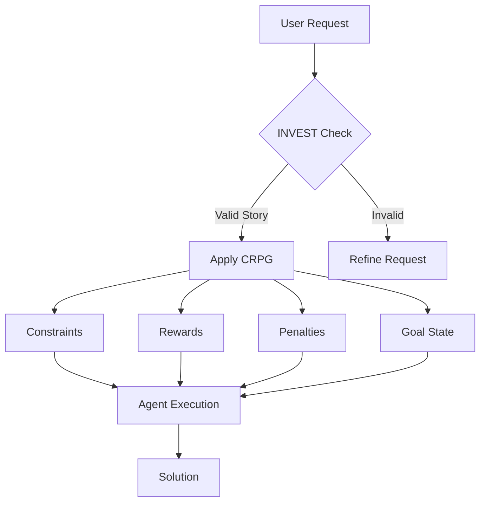

# Foundation: The INVEST+CRPG Framework

## Introduction

The INVEST+CRPG framework combines agile software development principles with AI optimization techniques. Think of it as creating a "contract" between you and the AI agents that ensures both parties understand the task, success criteria, and boundaries.

## Human Analogy

Imagine you're a project manager briefing a new team member. You wouldn't just say "build something." Instead, you'd:
1. Explain what needs to be built and why (INVEST)
2. Set clear boundaries and resources (Constraints)
3. Define success metrics (Rewards)
4. Warn about common mistakes (Penalties)
5. Describe the finished product (Goal State)

## The INVEST Framework

INVEST ensures every request is well-formed:

### Components
- **Independent**: Can be completed without waiting for other tasks
- **Negotiable**: Implementation details are flexible
- **Valuable**: Delivers clear benefit
- **Estimable**: Effort can be predicted
- **Small**: Fits within reasonable scope
- **Testable**: Success can be verified

### Example User Story
```
As a computer vision researcher
I want to implement a ResNet50 for CIFAR-10
So that I can establish a performance baseline
```

## The CRPG Optimization Framework

CRPG guides how agents approach the solution:

### Constraints
Boundaries that must be respected:
- Technical limitations (GPU memory, compute time)
- Compatibility requirements (PyTorch version, dependencies)
- Code standards (style, documentation)

### Rewards
Positive outcomes to maximize:
- Performance metrics (accuracy, speed)
- Code quality (readability, modularity)
- Resource efficiency (memory usage, training time)

### Penalties
Mistakes to avoid:
- Anti-patterns (memory leaks, inefficient loops)
- Poor practices (hardcoded values, missing tests)
- Violations (exceeding resource limits)

### Goal State
Clear definition of success:
- Deliverables (trained model, evaluation metrics)
- Validation criteria (test accuracy > 90%)
- Documentation requirements

## Visual Representation



## Combining INVEST and CRPG

The frameworks work together:

1. **INVEST** defines WHAT needs to be done
2. **CRPG** defines HOW to approach it optimally

### Complete Template Structure

```markdown
## User Story (INVEST)
As a [role]
I want to [goal]
So that [benefit]

## CONSTRAINTS
- [Technical boundary]
- [Resource limit]
- [Compatibility requirement]

## REWARDS
- [Performance target]
- [Quality metric]
- [Efficiency goal]

## PENALTIES
- [Anti-pattern to avoid]
- [Bad practice]
- [Resource violation]

## GOAL STATE
- [Deliverable]
- [Success criterion]
- [Validation method]
```

## Real-World Example

### Task: Image Classification Pipeline

```markdown
## User Story
As a ML engineer
I want to build a data pipeline for ImageNet
So that I can train vision models efficiently

## CONSTRAINTS
- Maximum 16GB GPU memory
- PyTorch 2.0+ compatible
- Must handle corrupted images gracefully

## REWARDS
- Data loading < 20% of training time
- Support for multiple augmentation strategies
- Memory-efficient batch collation

## PENALTIES
- Loading entire dataset into memory
- No data validation
- Blocking I/O operations

## GOAL STATE
- Working DataLoader with benchmarks
- Unit tests for all components
- Documentation with usage examples
```

## Why This Works

### For Humans
- Clear communication of requirements
- Predictable outcomes
- Measurable success

### For AI Agents
- Structured input format
- Optimization targets
- Clear boundaries

### Human-to-Human Parallel
Like a well-run standup meeting where everyone knows:
- What needs to be done (INVEST)
- How to do it well (Rewards)
- What to avoid (Penalties)
- When it's complete (Goal State)

## Key Takeaways

1. **Structure enables creativity**: Constraints paradoxically lead to better solutions
2. **Explicit is better than implicit**: Clear requirements prevent misunderstandings
3. **Optimization needs direction**: CRPG provides the "fitness function" for agent behavior

## Next Steps

Now that you understand the foundation, let's explore how [Chain of Thought](02-chain-of-thought.md) reasoning enhances this framework →