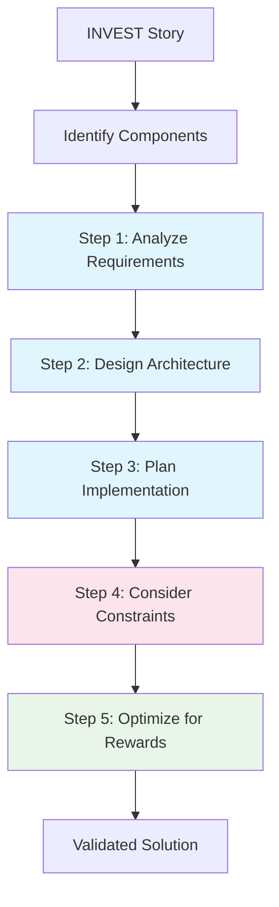

# Chain of Thought Integration with INVEST+CRPG

## Overview

Chain of Thought (CoT) prompting adds explicit reasoning steps to problem-solving. When combined with INVEST+CRPG, it creates a powerful framework where requirements are clear (INVEST), reasoning is transparent (CoT), and execution is optimized (CRPG).

## Human Analogy

Think of CoT like "thinking aloud" during pair programming. When you explain your reasoning step-by-step to a colleague, you often catch mistakes, find better solutions, and make your thought process reviewable by others.

## How CoT Enhances INVEST+CRPG

### Without CoT
```
Request → Solution
```

### With CoT
```
Request → Reasoning Steps → Validated Solution
```

## Visual Flow



## CoT in Machine Learning Tasks

### Example: Designing a Neural Network

#### Standard Prompt
```
Create a CNN for CIFAR-10 classification
```

#### CoT-Enhanced Prompt
```
Create a CNN for CIFAR-10 classification. Let's think step by step:
1. What are CIFAR-10's characteristics?
2. What architecture patterns work well?
3. What are our resource constraints?
4. How do we prevent overfitting?
5. What's our training strategy?
```

## Integrating CoT with INVEST Stories

### Pattern 1: Reasoning Within Constraints

```markdown
## User Story
As a researcher
I want to achieve 95% accuracy on CIFAR-10
So that I can publish competitive results

## Chain of Thought Process
Let me work through this systematically:

1. **Baseline Analysis**: CIFAR-10 has 10 classes, 32x32 RGB images
   - Small images → don't need very deep network
   - Limited data (60k) → regularization important

2. **Architecture Selection**:
   - ResNet performs well on CIFAR-10
   - Given constraint of 8GB GPU → ResNet18 or ResNet34

3. **Training Strategy**:
   - Data augmentation essential for small dataset
   - Learning rate scheduling improves convergence
   - Mixup/CutMix can boost performance

4. **Optimization Path**:
   - Start with proven baseline
   - Incrementally add improvements
   - Track metrics at each step
```

### Pattern 2: Breaking Down Complex Tasks

```markdown
## Task: Multi-GPU Training Pipeline

## CoT Breakdown:
1. **Data Distribution Strategy**
   - Option A: Data Parallel (simpler)
   - Option B: Model Parallel (for large models)
   - Decision: Data Parallel fits our model size

2. **Synchronization Method**
   - All-reduce for gradient aggregation
   - Batch size scaling considerations
   - Learning rate adjustment needed

3. **Implementation Steps**
   - Wrap model in DistributedDataParallel
   - Adjust data loaders for distributed sampling
   - Modify training loop for gradient synchronization

4. **Validation Approach**
   - Verify gradients match single-GPU
   - Check scaling efficiency
   - Ensure reproducibility
```

## CoT Templates for Common ML Tasks

### Template 1: Model Selection
```markdown
Let's select the right model:
1. Task requirements: [input/output format]
2. Data characteristics: [size, complexity]
3. Performance targets: [accuracy, latency]
4. Resource constraints: [memory, compute]
5. Recommended approach: [model choice with reasoning]
```

### Template 2: Debugging Performance Issues
```markdown
Let's diagnose the performance problem:
1. Symptom observation: [what's happening]
2. Potential causes: [list possibilities]
3. Diagnostic tests: [how to verify each]
4. Root cause: [identified issue]
5. Solution: [fix with explanation]
```

### Template 3: Optimization Strategy
```markdown
Let's optimize this training:
1. Current bottleneck: [profiling results]
2. Optimization options: [possible improvements]
3. Cost-benefit analysis: [effort vs gain]
4. Implementation plan: [ordered steps]
5. Success metrics: [how to measure improvement]
```

## Combining CoT with CRPG

### Enhanced CRPG with Reasoning

```markdown
## CONSTRAINTS (with reasoning)
- GPU Memory: 8GB
  → Reasoning: Limits batch size to 128 for ResNet50
  → Reasoning: Requires gradient accumulation for effective batch of 512

## REWARDS (with reasoning)
- Accuracy > 95%
  → Reasoning: Achievable with proper augmentation
  → Reasoning: Requires at least 200 epochs training

## PENALTIES (with reasoning)
- Training time > 24 hours
  → Reasoning: Use mixed precision to accelerate
  → Reasoning: Optimize data loading pipeline

## GOAL STATE (with reasoning)
- Reproducible results
  → Reasoning: Fix all random seeds
  → Reasoning: Document exact environment
```

## Real-World Application

### Complete Example: Vision Transformer Implementation

```markdown
## User Story
As a computer vision engineer
I want to implement Vision Transformer for ImageNet
So that I can explore attention-based architectures

## Chain of Thought Process

### Step 1: Understand ViT Architecture
- Images divided into patches (typically 16x16)
- Patches treated as sequence tokens
- Positional embeddings added
- Standard transformer encoder processes sequence

### Step 2: Identify Implementation Challenges
- Memory usage scales quadratically with sequence length
- ImageNet images (224x224) → 196 patches
- Attention computation will be bottleneck

### Step 3: Apply Constraints
- Given 16GB GPU memory
- Can fit batch size of 64 with gradient checkpointing
- Need efficient attention implementation

### Step 4: Optimization Strategy
- Use pre-trained weights when available
- Implement mixed precision training
- Consider efficient attention variants if needed

### Step 5: Success Criteria
- Match published accuracy (±0.5%)
- Training completes in < 72 hours
- Code is modular and reusable
```

## Benefits of CoT in ML Development

1. **Error Prevention**: Catch issues before implementation
2. **Knowledge Transfer**: Reasoning is documented
3. **Debugging Aid**: Clear logic trail when issues arise
4. **Learning Tool**: Understand why, not just what

## Human Parallel

Like a senior engineer mentoring a junior:
- Shows the thinking process, not just the answer
- Explains trade-offs and decisions
- Makes expertise transferable

## Key Principles

1. **Make reasoning explicit**: Don't skip steps
2. **Consider alternatives**: Show why you chose this path
3. **Connect to requirements**: Link reasoning back to INVEST story
4. **Validate assumptions**: Check reasoning against constraints

## Next Steps

With reasoning made explicit through CoT, we can now add [action capabilities with ReAct](03-react-framework.md) →