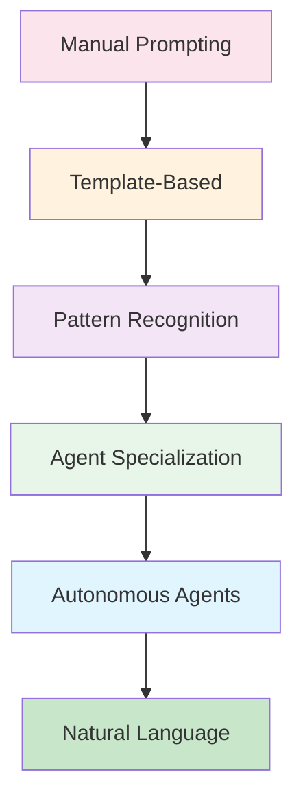
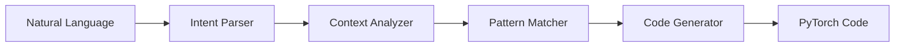

# The Path to Prompt-Free PyTorch Development

## Vision

Imagine describing your ML task in plain English and receiving production-ready PyTorch code without writing detailed prompts. This is the goal: natural language to neural networks.

## Current State vs Future State

### Today: Detailed Prompting
```
"Create a ResNet50 with CIFAR-10 dataloader using augmentation,
implement distributed training with mixed precision, add
tensorboard logging, use cosine annealing schedule..."
```

### Tomorrow: Natural Requests
```
"I need to classify CIFAR-10 images efficiently"
```

## The Automation Journey



## Level 1: Template Standardization

### Current Approach
Use pre-defined templates from `prompt-templates/`:

```markdown
## Standardized Request Format
Task: [Image Classification]
Dataset: [CIFAR-10]
Performance Target: [95% accuracy]
Constraints: [8GB GPU]
```

### Automation Opportunity
Templates become function calls:
```python
create_vision_pipeline(
    task="classification",
    dataset="cifar10",
    target_metric=0.95,
    gpu_memory="8GB"
)
```

## Level 2: Pattern Learning

### Recurring Patterns

The system learns common patterns:

```markdown
Pattern: "Small dataset + High accuracy requirement"
Automatic additions:
- Data augmentation
- Transfer learning
- Regularization techniques
- Cross-validation
```

### Implementation
```python
class PatternMatcher:
    def analyze_request(self, task):
        if task.dataset_size < 10000 and task.target > 0.90:
            return self.small_data_high_accuracy_pattern()
```

## Level 3: Agent Specialization Evolution

### Current: Explicit Agent Calls
```markdown
@agent-DatasetCurator find image datasets
@agent-NetworkArchitect design CNN
@agent-TrainingOrchestrator implement training
```

### Future: Automatic Routing
```markdown
"Build image classifier"
→ System automatically engages all necessary agents
```

### Agent Learning

Agents develop expertise through usage:

```python
class EvolvingAgent:
    def __init__(self):
        self.experience = []

    def learn_from_task(self, task, outcome):
        self.experience.append({
            'context': task,
            'approach': self.solution,
            'result': outcome
        })

    def suggest_solution(self, new_task):
        similar = self.find_similar_tasks(new_task)
        return self.adapt_successful_patterns(similar)
```

## Level 4: Context-Aware Automation

### Intelligent Defaults

System infers requirements from context:

```markdown
Input: "Train on ImageNet"
System infers:
- Large-scale distributed training needed
- Memory-efficient data loading required
- Standard augmentation pipeline
- Multi-node setup beneficial
```

### Code Generation Pipeline



## Level 5: Conversational Development

### Natural Dialogue

```markdown
User: "I want to classify medical images"

System: "I'll help you build a medical image classifier.
Based on your request, I'm setting up:
- Privacy-preserving data pipeline
- Transfer learning from ImageNet
- Class imbalance handling
- Interpretability tools

Shall I proceed?"

User: "Yes, but I only have 1000 images"

System: "Adjusting for small medical dataset:
- Adding heavy augmentation
- Using few-shot learning
- Implementing cross-validation
- Setting up active learning pipeline"
```

## Building Blocks for Automation

### 1. Semantic Understanding

```python
class RequestParser:
    def parse(self, text):
        return {
            'task_type': self.identify_task(text),
            'constraints': self.extract_constraints(text),
            'implicit_requirements': self.infer_needs(text)
        }
```

### 2. Solution Synthesis

```python
class SolutionBuilder:
    def build(self, parsed_request):
        components = []
        components.append(self.select_architecture())
        components.append(self.design_pipeline())
        components.append(self.configure_training())
        return self.assemble_solution(components)
```

### 3. Continuous Learning

```python
class LearningSystem:
    def improve(self, feedback):
        self.update_patterns()
        self.refine_templates()
        self.optimize_defaults()
```

## Practical Steps Toward Automation

### Step 1: Standardize Common Tasks

Create reusable components:
```python
# Instead of writing from scratch each time
def standard_vision_pipeline(dataset_name, model_name):
    # Encapsulated best practices
    return complete_pipeline
```

### Step 2: Build Task Libraries

```python
TASK_LIBRARY = {
    'image_classification': ImageClassificationTask,
    'object_detection': ObjectDetectionTask,
    'segmentation': SegmentationTask,
}

# Usage
task = TASK_LIBRARY['image_classification'](config)
task.run()
```

### Step 3: Create Meta-Prompts

Prompts that generate prompts:
```markdown
"Generate the optimal prompt for training
a transformer on time-series data with
limited compute resources"
```

### Step 4: Develop Agent Memories

```python
class AgentMemory:
    def remember_success(self, context, solution):
        self.memory.add(context, solution, success=True)

    def recall_similar(self, new_context):
        return self.memory.find_similar(new_context)
```

## The Role of INVEST+CRPG in Automation

### Structured Foundation

INVEST+CRPG provides the structure that enables automation:

1. **Predictable Format**: Machines can parse structured input
2. **Clear Objectives**: Automated systems know what success looks like
3. **Bounded Search**: Constraints limit the solution space
4. **Optimization Targets**: Rewards guide automated decisions

### Evolution Path

```markdown
Manual INVEST+CRPG →
Templated INVEST+CRPG →
Auto-generated INVEST+CRPG →
Implicit INVEST+CRPG →
Natural Language
```

## Future Capabilities

### Predictive Development

System anticipates needs:
```markdown
User: "Working with medical images"
System: "I notice you're working with medical data.
I've prepared HIPAA-compliant pipelines and
interpretability tools you'll likely need."
```

### Adaptive Optimization

System learns your preferences:
```markdown
System: "Based on your past projects, you prefer:
- Interpretable models over black boxes
- Fast iteration over perfect optimization
- Modular code structure
I've adjusted my approach accordingly."
```

## Challenges and Solutions

### Challenge 1: Context Understanding
**Solution**: Rich context modeling with project history

### Challenge 2: Error Recovery
**Solution**: Self-debugging with ReAct patterns

### Challenge 3: User Trust
**Solution**: Explainable decisions with CoT reasoning

## Human Analogy

The evolution is like hiring progressively more experienced developers:

1. **Junior**: Needs detailed instructions (templates)
2. **Mid-level**: Recognizes patterns (pattern matching)
3. **Senior**: Makes good default choices (agent specialization)
4. **Principal**: Understands implicit requirements (context-aware)
5. **Partner**: Discusses strategy naturally (conversational)

## Roadmap to Implementation

### Phase 1: Foundation (Current)
- Standardized templates
- Agent specialization
- INVEST+CRPG framework

### Phase 2: Intelligence (Next)
- Pattern recognition
- Context awareness
- Learning from usage

### Phase 3: Autonomy (Future)
- Natural language understanding
- Predictive assistance
- Self-improvement

## Call to Action

Start building toward automation by:

1. **Using templates consistently** - Build the pattern library
2. **Documenting patterns** - Capture what works
3. **Creating reusable components** - Don't repeat yourself
4. **Sharing successful prompts** - Learn from community
5. **Providing feedback** - Help agents learn

## Conclusion

The path to prompt-free PyTorch development is not about replacing MLE creativity but augmenting it. By building on INVEST+CRPG foundations with advanced prompting techniques, we're creating a future where the barrier between idea and implementation disappears.

The goal: Think it, describe it, have it built.

## Next Steps

Continue to [The MLE's Journey](06-mle-learning-path.md) to understand how MLEs can develop expertise alongside these automation capabilities →