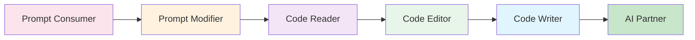

# The MLE's Journey: From Prompts to Partnership

## Introduction

While AI agents become increasingly sophisticated at generating PyTorch code, MLEs face a critical choice: remain dependent on prompts or develop genuine expertise alongside AI tools. This guide charts a path for MLEs to evolve from prompt consumers to skilled practitioners who collaborate effectively with AI.

The goal isn't to compete with AI but to develop complementary skills that make you irreplaceable—combining domain expertise, creative problem-solving, and deep understanding with AI's efficiency and breadth.

## The Learning Spectrum



## Stage 1: Prompt Consumer

### Characteristics
- Copy-paste prompt templates
- Minimal understanding of generated code
- Success measured by "it works"
- Heavy reliance on agents for debugging

### Example Behavior
```markdown
MLE: "Create a CNN for CIFAR-10"
Agent: [Generates complete code]
MLE: [Copies code, runs it]
```

### Skills to Develop
- Read the generated code line by line
- Ask yourself: "What does each part do?"
- Run code in segments to understand flow
- Start recognizing PyTorch patterns

## Stage 2: Prompt Modifier

### Characteristics
- Adapts existing templates
- Understands prompt structure
- Can specify requirements clearly
- Beginning to recognize patterns

### Example Behavior
```markdown
MLE: "Create a CNN for CIFAR-10, but with:
- ResNet architecture
- Data augmentation
- Learning rate scheduling"
```

### Skills to Develop
- Learn INVEST+CRPG framework deeply
- Understand how prompt changes affect output
- Start predicting what code will be generated
- Build vocabulary of ML concepts

## Stage 3: Code Reader

### Characteristics
- Understands generated code
- Can explain what each component does
- Identifies potential issues
- Debugs simple problems independently

### Example Behavior
```python
# MLE reads generated code and understands:
self.conv1 = nn.Conv2d(3, 64, kernel_size=7, stride=2, padding=3)
# "This takes RGB images (3 channels) and outputs 64 feature maps"
# "The 7x7 kernel with stride 2 downsamples by half"
```

### Skills to Develop
- PyTorch tensor operations
- Understanding gradients and backpropagation
- Common design patterns
- Debugging techniques

### Knowledge Checkpoint
Can you:
- [ ] Explain what each layer in a network does?
- [ ] Trace tensor shapes through the network?
- [ ] Identify why a model isn't training?
- [ ] Understand memory and compute implications?

## Stage 4: Code Editor

### Characteristics
- Modifies generated code confidently
- Adds custom functionality
- Optimizes existing solutions
- Combines multiple generated components

### Example Behavior
```python
# Takes generated base code and adds custom loss
class CustomLoss(nn.Module):
    def __init__(self, alpha=0.25):
        super().__init__()
        self.alpha = alpha

    def forward(self, pred, target):
        ce_loss = F.cross_entropy(pred, target)
        # MLE adds regularization term
        reg_loss = self.alpha * torch.norm(pred, p=2)
        return ce_loss + reg_loss
```

### Skills to Develop
- PyTorch module system
- Custom layers and losses
- Training loop modifications
- Performance optimization

## Stage 5: Code Writer

### Characteristics
- Writes components from scratch
- Uses AI for specific lookups/boilerplate
- Designs architectures independently
- Solves problems without prompting

### Example Behavior
```python
# MLE writes custom architecture
class AttentionBlock(nn.Module):
    def __init__(self, dim, heads=8):
        super().__init__()
        self.attention = nn.MultiheadAttention(dim, heads)
        self.norm = nn.LayerNorm(dim)

    def forward(self, x):
        attn_out, _ = self.attention(x, x, x)
        return self.norm(attn_out + x)

# Uses agent only for: "What's the exact syntax for MultiheadAttention?"
```

### Skills to Develop
- Design patterns and architectures
- Memory-efficient implementations
- Distributed training
- Custom optimizers

## Stage 6: AI Partner

### Characteristics
- Seamless collaboration with AI
- Knows exactly when to use agents
- Focuses on high-level design
- Teaches and learns from AI

### Collaboration Pattern
```markdown
MLE: "I'm designing a new architecture for video understanding.
      Here's my approach: [high-level design]
      Can you implement the temporal attention module?"

Agent: [Implements specific component]

MLE: [Reviews, modifies, integrates into larger system]
     "Good, but let's make the attention causal for online inference"
```

### Partnership Division

| MLE Focuses On | Agent Handles |
|----------------|---------------|
| Architecture design | Boilerplate code |
| Algorithm selection | Syntax lookup |
| Business logic | Standard patterns |
| Performance strategy | Implementation details |
| Debugging approach | Error message interpretation |

## Learning Strategies

### 1. Progressive Challenge
Start with modifications, gradually increase scope:
```
Week 1: Modify hyperparameters
Week 2: Change loss functions
Week 3: Adjust architecture
Week 4: Write training loop
Week 5: Design custom layer
Week 6: Build complete pipeline
```

### 2. Code Archaeology
Study generated code like a learning resource:
```python
# Generated code
optimizer = torch.optim.AdamW(model.parameters(), lr=2e-5, weight_decay=0.01)

# Your analysis:
# - AdamW vs Adam: includes weight decay decoupling
# - lr=2e-5: standard for transformer fine-tuning
# - weight_decay: L2 regularization effect
```

### 3. Agent-Free Zones
Regular practice without AI assistance:
- Monday: Implement one function from scratch
- Wednesday: Debug without asking agent
- Friday: Write complete module solo

### 4. Explain-First Method
Before running generated code:
1. Read it completely
2. Explain what it should do
3. Predict the output
4. Run and verify understanding

## Practical Exercises

### Exercise 1: Gradient Flow
```markdown
Task: Without using agents, implement gradient clipping
Skill: Understanding backpropagation
```

### Exercise 2: Memory Optimization
```markdown
Task: Reduce memory usage of generated model by 50%
Skill: Understanding PyTorch internals
```

### Exercise 3: Custom Dataset
```markdown
Task: Write DataLoader for your specific use case
Skill: Data pipeline design
```

### Exercise 4: Debugging Challenge
```markdown
Task: Fix a model that's not converging (agent can't help)
Skill: Systematic debugging
```

## Knowledge Milestones

### Foundational (Months 1-2)
- [ ] Understand tensor operations
- [ ] Know common layers and their purposes
- [ ] Can modify existing architectures
- [ ] Basic debugging skills

### Intermediate (Months 3-4)
- [ ] Design simple architectures
- [ ] Implement custom losses
- [ ] Optimize training loops
- [ ] Profile and improve performance

### Advanced (Months 5-6)
- [ ] Create novel architectures
- [ ] Implement papers from scratch
- [ ] Design distributed training
- [ ] Contribute to PyTorch ecosystem

## Anti-Patterns to Avoid

### 1. Copy-Paste Programming
```markdown
❌ Bad: Copy code, hope it works
✓ Good: Understand, then integrate
```

### 2. Learned Helplessness
```markdown
❌ Bad: "I can't do this without AI"
✓ Good: "Let me try first, then ask for help"
```

### 3. Shallow Understanding
```markdown
❌ Bad: "It works, that's enough"
✓ Good: "It works, and I know why"
```

### 4. Over-Reliance
```markdown
❌ Bad: Ask agent for every syntax question
✓ Good: Build mental model, verify with docs
```

## The Expertise Portfolio

### What MLEs Master
- **Domain Knowledge**: Understanding the problem space
- **Algorithm Selection**: Choosing right approach
- **System Design**: Architecture and scaling
- **Business Context**: Constraints and requirements
- **Creative Solutions**: Novel approaches

### What Agents Provide
- **Syntax Reference**: Exact API usage
- **Boilerplate**: Standard implementations
- **Best Practices**: Common patterns
- **Error Messages**: Quick debugging
- **Documentation**: Instant lookups

## Building Confidence

### Week 1-2: Foundation
- Read every line of generated code
- Run code in segments
- Modify one small thing

### Week 3-4: Understanding
- Explain code to others
- Debug simple issues
- Combine multiple examples

### Week 5-6: Independence
- Write simple functions alone
- Modify architectures
- Implement from pseudocode

### Week 7-8: Mastery
- Design custom solutions
- Optimize performance
- Teach concepts to others

## Real-World Progression Example

### Month 1: CIFAR-10 Classifier
```markdown
Stage: Prompt Consumer
Action: Use template to create basic CNN
Learning: What convolutions do
```

### Month 2: Custom Dataset
```markdown
Stage: Code Reader
Action: Adapt template for new data
Learning: DataLoader internals
```

### Month 3: Architecture Modification
```markdown
Stage: Code Editor
Action: Add attention layers to CNN
Learning: Hybrid architectures
```

### Month 4: Novel Solution
```markdown
Stage: Code Writer
Action: Design architecture for specific problem
Learning: First principles thinking
```

### Month 5: Research Implementation
```markdown
Stage: AI Partner
Action: Implement cutting-edge paper
Collaboration: MLE designs, AI helps with details
```

## The Partnership Mindset

### Effective Collaboration
```markdown
MLE: "I need a efficient way to process variable-length sequences"
Agent: "Here are three approaches: padding, packing, or dynamic batching"
MLE: "Let's go with packing. I'll design the overall flow, you handle the pack_padded_sequence details"
```

### Learning from AI
- Treat generated code as learning material
- Ask "why" not just "how"
- Request explanations with code
- Study different approaches

### Teaching AI
- Provide clear context
- Share domain knowledge
- Correct mistakes
- Build better prompts

## Conclusion

The journey from prompt consumer to AI partner isn't about replacing AI—it's about developing complementary expertise. As AI handles increasingly complex implementation details, MLEs who understand fundamentals, design systems, and solve novel problems become more valuable, not less.

Your goal: Be the architect who collaborates with AI builders, not the operator who depends on AI instructions.

## Next Steps

1. **Assess your current stage** honestly
2. **Set learning goals** for the next month
3. **Practice deliberately** in agent-free zones
4. **Build projects** that push your boundaries
5. **Share knowledge** with other MLEs

Remember: Every expert MLE started by reading their first line of PyTorch code. The difference is the deliberate journey from consumption to creation.