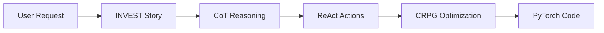

# Prompting Guide for PyTorch ML Development

This guide explains how to combine established prompting techniques with the INVEST+CRPG framework to create effective machine learning solutions using PyTorch and specialized agents.

## Overview

This repository uses a unique combination of:
- **INVEST**: Agile user stories that define clear requirements
- **CRPG**: Optimization framework that guides agent behavior
- **Advanced Prompting**: Techniques like Chain of Thought and ReAct for enhanced reasoning

Think of this as teaching a team of specialists how to work together, where each conversation follows a structured pattern that leads to working code.

## Guide Structure

1. **[Foundation Concepts](01-foundation.md)** - Understanding INVEST+CRPG framework
2. **[Chain of Thought Integration](02-chain-of-thought.md)** - Step-by-step reasoning in ML tasks
3. **[ReAct Framework](03-react-framework.md)** - Combining reasoning with tool actions
4. **[Hybrid Techniques](04-hybrid-techniques.md)** - Combining multiple approaches
5. **[PyTorch Automation Path](05-pytorch-automation.md)** - Moving toward prompt-free development
6. **[MLE Learning Path](06-mle-learning-path.md)** - Building expertise alongside AI agents

## Quick Start

### Basic Pattern
```
User Story (INVEST) → Reasoning Steps (CoT) → Actions (ReAct) → Optimization (CRPG)
```

### Human Analogy
Imagine briefing a development team:
- **INVEST**: "Here's what we need and why"
- **Chain of Thought**: "Let me think through this step by step"
- **ReAct**: "I'll research, then implement, then verify"
- **CRPG**: "Here are the success metrics and constraints"

## Core Concepts at a Glance



## When to Use Each Technique

| Situation | Technique | Example |
|-----------|-----------|---------|
| Complex logic needed | Chain of Thought | Designing neural architecture |
| External data required | ReAct | Fetching datasets, checking documentation |
| Clear requirements | INVEST | Feature implementation |
| Performance critical | CRPG | Training optimization |

## Progressive Complexity

### Level 1: Basic INVEST+CRPG
Start with structured user stories and optimization parameters.

### Level 2: Add Chain of Thought
Include reasoning steps for complex problems.

### Level 3: Integrate ReAct
Add tool usage and external knowledge retrieval.

### Level 4: Hybrid Approach
Combine all techniques for sophisticated workflows.

### Level 5: Automation
Build patterns that eliminate repetitive prompting.

## Examples Directory

- [Basic CoT Example](examples/basic-cot.md) - Simple reasoning chain
- [ReAct Workflow](examples/react-workflow.md) - Tool usage pattern
- [Full Pipeline](examples/full-pipeline.md) - Complete ML task

## Key Principles

1. **Structure First**: Always start with clear requirements (INVEST)
2. **Reason Explicitly**: Show your thinking process (CoT)
3. **Act Deliberately**: Use tools when needed (ReAct)
4. **Optimize Continuously**: Follow constraints and seek rewards (CRPG)

## Goal: Prompt-Free PyTorch

The ultimate aim is to build patterns and agents sophisticated enough that you can simply describe what you want in natural language, and the system generates production-ready PyTorch code without detailed prompting.

## Navigation

Start with [Foundation Concepts](01-foundation.md) →